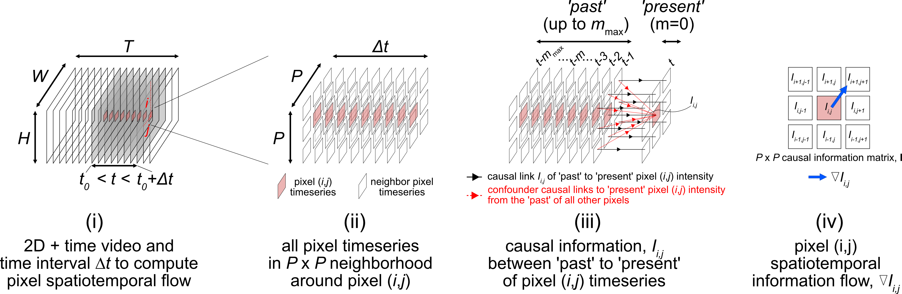
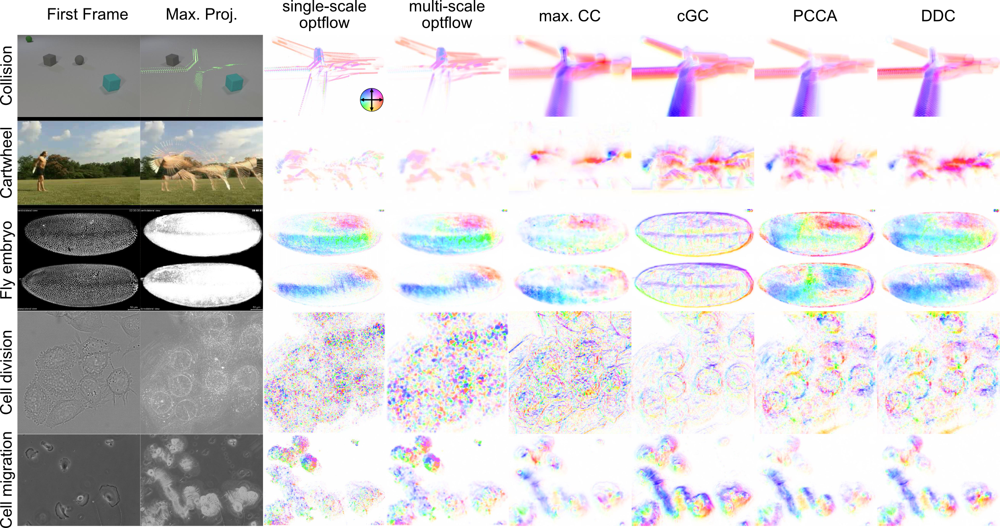

# u-infotrace (Multiscale Pixel Spatiotemporal Information Flows)
<p align="center">
  
  <!--  -->
</p>
u-infotrace (multiscale pixel spatiotemporal information flows) is a formal modelling framework to systematically apply 1D causal measures to image pixels. Neighborhood pixels are naturally correlated spatiotemporally which complicates direct application of 1D causal measures. Here we model the NxN pixel neighborhood as a rigid body and demonstrate how to condition to extract the dense pixel-to-pixel information transfer in 2D + time videos using any desired 1D causal measure, and in a multiscale manner. In our paper we show how we can discover salient pixel-to-pixel information highways in videos of diverse phenomena spanning traffic and crowd flow, collision physics, fish swarming, moving camouflaged animals, human action, embryo development, cell division and cell migration.<br>

For more information, please read our paper, [**Multiscale Pixel Spatiotemporal Information Flows**](https://openreview.net/forum?id=4P0qQrU_SlN), *A causal view on dynamical systems, NeurIPS 2022 workshop*, written by Felix Yuran Zhou, Roshan Ravishankar.

If you use the code or think our work is useful in your research, please consider citing:

```
@INPROCEEDINGS{zhou2022multiscale,
	AUTHOR = {Zhou, Felix Yuran and Ravishankar, Roshan},
	TITLE = {Multiscale Pixel Spatiotemporal Information Flows},
	BOOKTITLE = {A causal view on dynamical systems, NeurIPS 2022 workshop},
	YEAR = {2022},
}
```

## Different information flow extracted from diverse videos compared to optical flow
<p align="center">
  
</p>
Compared to optical flow, information flows (right columns from cGC onward) capture salient patterns and reveal 'information highways'. Depending on the modelling assumptions of the 1D causal measure, we find information flow highlights different attributes of the pixel-to-pixel relationship in videos. 

### Dependencies
u-infotrace relies on the following excellent packages (which currently requires manual installation). See also requirements.txt file. All can be readily installed using conda or pip
- [numpy](https://numpy.org/)
- [scipy](https://www.scipy.org/)
- [scikit-image](https://scikit-image.org/)
- [scikit-learn](https://scikit-learn.org/stable/index.html)
- [matplotlib](https://matplotlib.org/)
- [opencv](https://pypi.org/project/opencv-contrib-python/)
- [tqdm](https://tqdm.github.io/)

### Installation
The package can be installed after cloning this repository using the following command.
```
pip install .
```

### Example script
2023-03-31_testScript_InfoFlow_shorter.py demonstrates how to extract the u-infotrace using a variety of 1D causal measures for a video from the crowdflow dataset (https://www.crcv.ucf.edu/research/data-sets/crowd-segmentation/) downsampled by a factor of 8.  

### Issues
Please contact Felix Zhou, felixzhou1@gmail.com

### Danuser Lab Links
[Danuser Lab Website](https://www.danuserlab-utsw.org/)

[Software Links](https://github.com/DanuserLab/)
